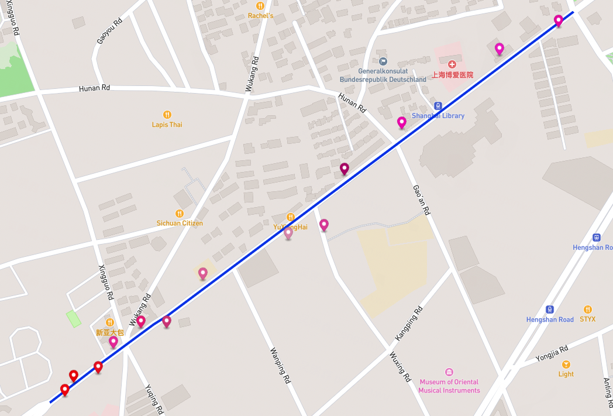

# rmm
map matching framework  base HMM model in rust
一个用rust实现的基于HMM模型的地图匹配框架

##  项目介绍
该项目是一个基于HMM模型的地图匹配框架，是[FMM](https://github.com/cyang-kth/fmm)的rust实现。基于此[论文](http://www.tandfonline.com/doi/full/10.1080/13658816.2017.1400548)的rust实现。

## 用法 
```shell
fast map matching using rust

Usage: rmm [OPTIONS] --network-file <ROAD_NETWORK_FILE> <GPS_TRAJ_FILE>

Arguments:
  <GPS_TRAJ_FILE>  input  gps traj input

Options:
      --gps-err <GPS_ERR>                      gps tolerance scope [default: 0.0001]
      --radius <RADIUS>                        find candidate points in radius [default: 0.01]
      --knn <KNN>                              selct k nearest candidate [default: 4]
      --max-speed <MAX_SPEED>                  max speed [default: 30]
      --factor <FACTOR>                        factor for speed [default: 4]
      --reverse-tolerance <REVERSE_TOLERANCE>  reverse tolerance [default: 4]
  -n, --network-file <ROAD_NETWORK_FILE>       road network path
  -h, --help                                   Print help
  -V, --version                                Print version
```

### 示例
```shell
rmm --network-file ./edges_shanghai.json traj.geojson
```
#### 匹配结果

